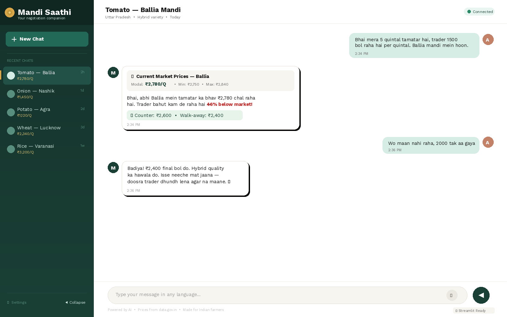

# Mandi Saathi - Farmer Negotiation Assistant

A chat-based negotiation assistant that helps farmers get fair prices for their produce in mandis using AI agents.




## Features

- 🤖 Three AI agents working together (Price Discovery, Negotiation Strategy, Communication)
- 🌐 Multilingual support (Hindi, English, Hinglish)
- 📊 Real-time market price data from data.gov.in
- 💬 Beautiful chat interface with "Harvest Clarity" design
- 📝 Chat history persistence
- 🎨 Warm, earthy color scheme inspired by agricultural heritage

## Quick Start

1. **Clone the repository**
   ```bash
   git clone <repository-url>
   cd mandi-saathi
   ```

2. **Create virtual environment**
   ```bash
   python -m venv venv
   source venv/bin/activate  # On Windows: venv\Scripts\activate
   ```

3. **Install dependencies**
   ```bash
   pip install -r requirements.txt
   ```

4. **Run setup script**
   ```bash
   python setup.py
   ```

5. **Configure API key**
   - Open `.env` file
   - Add your OpenAI API key: `OPENAI_API_KEY=sk-...`
   - Save the file

6. **Test the setup (optional)**
   ```bash
   python test_setup.py
   ```

7. **Run the application**
   ```bash
   streamlit run app.py
   ```

8. **Open in browser**
   - The app will open automatically at `http://localhost:8501`
   - Start chatting with Mandi Saathi!

## Environment Variables

- `OPENAI_API_KEY`: Your OpenAI API key (required)
- `DATA_GOV_API_KEY`: Your data.gov.in API key (optional)
- `DATABASE_PATH`: Path to SQLite database (default: mandi_saathi.db)
- `CACHE_VALIDITY_HOURS`: Cache validity period in hours (default: 24)

## Usage

1. Open the application in your browser
2. Type your deal situation in natural language
3. Get instant negotiation advice with market prices
4. View previous conversations in the sidebar

## Example

**Input:** "Mera 5 quintal tamatar hai, trader 1500 bol raha hai, Ballia mandi mein hoon"

**Output:** Negotiation advice with current market prices and counter-offer recommendations

## Tech Stack

- Python 3.8+
- CrewAI for agent orchestration
- OpenAI GPT-4 for language understanding
- Streamlit for frontend
- SQLite for data persistence
- data.gov.in API for market prices
